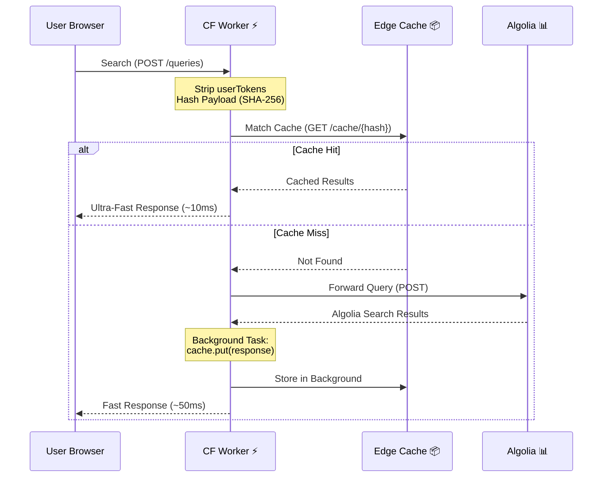

# ⚡️ Algolia Caching Proxy via Cloudflare Workers

[](https://www.algolia.com/)
[](https://workers.cloudflare.com/)
[](https://opensource.org/license/apache-2-0)

> A high-performance, drop-in **Cloudflare Worker middleware** that aggressively caches Algolia search requests globally at the edge, drastically slashing your Algolia operations bill without sacrificing search speed.

## 📖 What is this?

Algolia is blazingly fast but charges per search request. For high-traffic sites (e.g., e-commerce platforms, documentation hubs, or media portals), identical search queries are performed thousands of times a day. This directly translates to high, recurring costs. Even for open source or personal side projects, repetitive searches can quickly exhaust Algolia's free tier limits.

This **Cloudflare Worker** sits between your frontend application and Algolia's servers. It intercepts search requests and serves repeated queries directly from Cloudflare's massive global Edge CDN. The result? Cached requests **never** reach Algolia's servers, saving you money without sacrificing performance.

## ✨ Why You Need It

- 💸 **Huge Cost Savings**: Reduce billable Algolia operations by up to 100% for highly repetitive searches.
- ⚡️ **Edge Speed Delivery**: Serve cached search results from the absolute nearest Cloudflare node to your users (~10-30ms response times).
- 🔌 **Plug-and-Play Frontend Integration**: Integrates instantly by swapping out the Algolia host URL in your frontend client.
- 🔒 **Privacy-Safe & Deterministic**: Automatically strips dynamic, user-specific parameters (`userToken`) before hashing, ensuring that identical queries from different users safely share the exact same global cache.
- 🔑 **Universal Compatibility**: Supports all of Algolia's frontend libraries out of the box (InstantSearch, React, Vue, pure JS) by extracting credentials via both HTTP Headers and Query Parameters.
- 🏢 **Multi-App & Multi-Index Ready**: Because the SHA-256 cache key specifically incorporates the Algolia API Key found in the request payload, this worker natively and safely supports querying completely different Algolia Applications, API Keys, and Indexes simultaneously without any cache bleeding or collision. Deploy it once, and place it in front of all your projects.

### 💰 Cost Comparison

Algolia's pricing scales directly with your usage. Meanwhile, Cloudflare Workers offer a massive free tier and heavily discounted overages.

| Platform | Free Tier | Overage Cost | Pricing |
| :--- | :--- | :--- | :--- |
| **Algolia** | 10k searches/month | +$0.50 per 1K searches | [Algolia Pricing](https://www.algolia.com/pricing/) |
| **Cloudflare Workers** | 100k requests/day | +$0.30 per 1M requests | [Workers Pricing](https://developers.cloudflare.com/workers/platform/pricing/) |

### 📉 Estimated Monthly Savings

*Assuming cache is cleared once a month.*

| Searches / Month | Direct Algolia Cost | Cached via CF Worker | Cost Savings |
| ---: | ---: | ---: | ---: |
| **10,000** | $0 (Free) | $0 (Free) | **0%** |
| **100,000** | ~$45 | $0 (Free) | **100%** |
| **1,000,000** | ~$495 | $0 (Free) | **100%** |
| **10,000,000** | ~$4,995 | ~$5 | **~99.89%** |
| **100,000,000** | ~$49,995 | ~$27 | **~99.95%** |
| **1,000,000,000**| ~$499,995 | ~$297 | **~99.94%** |

> **Note**: Because the Worker needs at least one request to populate the cache initially (cache miss), your Algolia cost won't be absolute zero. However, it will be a fraction of the previous direct cost.

## 🏗️ How it Works

Algolia strictly requires `POST` requests for searches. However, virtually all CDN services (including Cloudflare) normally **only cache `GET` requests**. This worker uses a "Ghost GET Request" workaround to force Cloudflare to cache Algolia `POST` responses:

1. **Intercept & Cleanse**: Catches the incoming `POST` request and cleanses dynamic, non-cacheable tokens (like `userToken`) from the JSON POST body.
2. **Deterministic Hashing**: Generates a hyper-fast SHA-256 hash of the cleansed payload.
3. **Ghost GET Request**: Translates this hash into a simulated (ghost) `GET` URL to act as a unique cache-key for Cloudflare's Cache API.
4. **Resolution**:
   - **Cache Hit**: Resolves instantly directly from the Cloudflare Edge.
   - **Cache Miss**: Forwards the exact original `POST` payload to Algolia. Upon receiving the result, it is immediately served to the user, while simultaneously being saved to the Edge Cache via a background `ctx.waitUntil()` process.



## 🚀 Quick Start & Setup

### 1. Prerequisites

- [Node.js](https://nodejs.org/) installed on your machine.
- A free [Cloudflare Account](https://dash.cloudflare.com/sign-up).
- [Wrangler CLI](https://developers.cloudflare.com/workers/wrangler/install-and-update/) installed globally.

### 2. Installation

Clone the repository, enter the directory, and install the local packages:
```bash
git clone <repository-url> algolia-caching-proxy-via-cloudflare-worker
cd algolia-caching-proxy-via-cloudflare-worker
npm install
```

### 3. Development

Run the local Cloudflare development server:
```bash
npm run dev
```
Your worker will be locally accessible at `http://localhost:8787`.

### 4. Deploy to Production

Authenticate your terminal with Cloudflare:
```bash
npx wrangler login
```

Deploy the worker:
```bash
npm run deploy
```

## ⚙️ Configuration & Security

All major settings are located in `src/config.js`.

### Cache TTL (Time-To-Live)

Define how long search responses should stay cached:
- **`CDN_CACHE_TTL`**: Time on Cloudflare's Edge (Default: 1 Month).
- **`BROWSER_CACHE_TTL`**: Time in the user's local browser (Default: 1 Hour).

### Security & CORS Setup

> ⚠️ **Crucial for Production:** By default, `ALLOWED_ORIGIN` contains `'*'` for easy development and testing. This should be restricted before going live to prevent unauthorized access to your Algolia data or someone caching their own data in your account and using your bandwidth.

1. Open `src/config.js`.
2. Replace `'*'` with your actual frontend domain(s) (e.g., `'https://your-website.com'`). You can add multiple domains as separate strings in the array.
3. Redeploy the worker.
*(Note: For advanced CI/CD pipelines, consider overriding this value using `wrangler.jsonc` `[vars]` to avoid committing production domains to your source code repository).*

### 🛡️ Prevent Malicious Billing (Cache-Busting) Attacks

Because Algolia bills based on number of search requests, and this proxy caches does it based on the exact search string, an attacker could write a script that sends thousands of random, unique queries (e.g., `query="random-uuid-1"`). Since these will never hit the cache, and they will all be forwarded to Algolia and consume your Algolia quota.

You should configure **[Cloudflare Rate Limiting (WAF Rules)](https://developers.cloudflare.com/waf/rate-limiting-rules/)** on your Custom Domain to aggressively block IPs making an unnatural volume of search requests.

### Connect a Custom Domain (Highly Recommended)

Deploying to a default `.workers.dev` subdomain limits your caching capabilities. Attaching a Custom Domain in Cloudflare unlocks:

- **Smart Tiered Cache**: Instead of caching user requests only in the nearest Cloudflare datacenter, Cloudflare routes requests through centralized regional hubs. This significantly increases cache hit rates and reduces origin trips, **significantly lowering the number of requests sent to Algolia**. [Read more here.](https://developers.cloudflare.com/cache/how-to/tiered-cache/#smart-tiered-cache)
- **Manual Cache Purging**: Without a custom domain, you cannot manually clear the edge cache and must wait for the TTL to naturally expire.

#### How to configure

You can assign a custom domain using the Cloudflare Dashboard (under the Worker's **Triggers** tab), or by adding it directly to your `wrangler.jsonc` file:

```jsonc
"routes": [
  { 
    "pattern": "algolia-cache.yourdomain.com",
    "custom_domain": true
  }
]
```

## 💻 Client-Side Integration

To start routing traffic through your new Worker, add 'hosts' array to the Algolia client initialization config in your frontend code:

```javascript
import algoliasearch from 'algoliasearch';

const client = algoliasearch(
  'YOUR_APP_ID',
  'YOUR_SEARCH_API_KEY',
  {
    hosts: [
      // -----------------------------------------------------------
      // [OPTIONAL] LOCAL DEVELOPMENT
      // Uncomment the block below to route traffic to your local Wrangler dev server
      // when you run it locally.
      // (Make sure to comment out the Primary Production host and fallback hosts when doing this)
      // -----------------------------------------------------------
      // {
      //   protocol: "http",
      //   url: "localhost:8787",
      // },

      // -----------------------------------------------------------
      // 1. PRIMARY HOST (PRODUCTION)
      // This routes all search requests through your deployed Cloudflare Worker.
      // (Make sure to replace "algolia-cache.your-website.com" with the domain you assigned to your worker!)
      // -----------------------------------------------------------
      {
        protocol: "https", 
        url: "algolia-cache.your-website.com",
      },

      // -----------------------------------------------------------
      // 2. FALLBACK HOSTS (CRITICAL)
      // If the Cloudflare Worker fails or is unreachable, the Algolia client
      // will automatically retry the request using these official backup servers.
      // (Make sure to replace "YOUR_APP_ID" with your actual Application ID!)
      // -----------------------------------------------------------
      { protocol: "https", url: "YOUR_APP_ID-dsn.algolia.net" },
      { protocol: "https", url: "YOUR_APP_ID-1.algolianet.com" },
      { protocol: "https", url: "YOUR_APP_ID-2.algolianet.com" },
      { protocol: "https", url: "YOUR_APP_ID-3.algolianet.com" }
    ],
  }
);

// Initialize and use Algolia as normal
const index = client.initIndex('your_index_name');
index.search('query').then(({ hits }) => {
  console.log(hits);
});
```

> Read more in [Algolia's Custom Hosts Documentation](https://www.algolia.com/doc/libraries/sdk/customize#custom-hosts).

> **Peace of Mind Guarantee:** By explicitly defining these fallback hosts in your initialization, Algolia's SDK guarantees that if your Cloudflare Worker is ever down, misconfigured, or returning 5xx errors, it will instantly and smoothly route the user's search query to the official Algolia servers without breaking the frontend experience.

## ⚠️ Known Trade-offs & Limitations

Using an aggressive caching architecture inherently means you're trading a few of Algolia's dynamic features in exchange for speed and reduced costs. You must be aware of:

- **Search Only (Do not use for Backend/Indexing)**: This proxy is designed **exclusively for Search (Read) requests originating from frontend clients**. Do not configure your backend/indexing clients to use this proxy, as write operations will fail on Algolia's DSN endpoints.
- **Analytics Drift & Click Analytics Corruption**: Since cached queries never physically hit Algolia, your internal Algolia dashboard analytics (top searches, click CTRs, conversions) will underreport volume. **Crucially, if you rely on Click Analytics & Insights**, this proxy will break your tracking. It will serve the identical `queryID` to thousands of different users, resulting in highly distorted user journey tracking within Algolia's machine learning models.
- **No Native Personalization**: Algolia's "Personalized Results" feature heavily relies on the `userToken` header. Because this worker purposely strips the `userToken` off the request body (so the cache is homogenized globally across all users), native personalization will simply **not work**.
- **A/B Testing Impact**: If utilizing Algolia A/B testing dynamically behind the scenes, Cloudflare Edge caches might lock onto a specific A/B variant and erroneously serve it universally to all users.
- **P99 Initial Latency**: The very first time a brand new search term is queried (Cache Miss), the latency will feature a small 50-100ms penalty overhead due to the Worker acting as an intermediary network hop before consulting Algolia.

## 🔧 Maintenance & Troubleshooting

### Checking Cache Status

To verify if a response was served from the cache or fetched from the origin (Algolia), inspect the `cf-cache-status` header in the Worker's HTTP response.

- `HIT`: The response was served directly from Cloudflare's edge cache.
- `MISS`: The request was fetched from Algolia's origin and subsequently cached.
- `DYNAMIC`: The resource was not eligible to be cached based on your Cloudflare cache rules.

Read more in [Cloudflare's cf-cache-status header explained](https://www.debugbear.com/docs/cf-cache-status/).

### Live Worker Log Monitoring

If you're troubleshooting unexpected behavior, hook into real-time production Worker logs directly via your terminal:
```bash
npx wrangler tail algolia-caching-proxy-via-cloudflare-worker
```

### Invalidating Edge Caches

When performing a large-scale database sync directly to Algolia, you must force Cloudflare to wipe its edge cache (Note: this explicitly requires applying a Custom Domain mentioned above).

**Option 1: Via Cloudflare Dashboard UI:**
1. Select your domain.
2. Go to **Caching** > **Configuration**.
3. Hit **Purge Everything** (Or **Purge by Prefix**: `/cache/`).

See [Cloudflare Docs](https://developers.cloudflare.com/cache/how-to/purge-cache/) for more info.

**Option 2: Via Headless cURL (Automated Deployments):**
```bash
curl -X POST "https://api.cloudflare.com/client/v4/zones/<YOUR_ZONE_ID>/purge_cache" \
    -H "Authorization: Bearer <YOUR_API_TOKEN>" \
    -H "Content-Type: application/json" \
    --data '{"purge_everything":true}'
```

See [Cloudflare API Documentation](https://developers.cloudflare.com/api/resources/cache/) for more info.

## 📁 Project Structure

| File | Description |
| :--- | :--- |
| `src/index.js` | Primary Worker router handling Request/Response validation, cache verification, background storage, and origin forwarding. |
| `src/config.js` | Global system configurations governing cache TTLs and critical CORS origins. |
| `src/utils.js` | Cryptographic functions containing the deterministic SHA-256 worker hashing, CORS wrappers, and Algolia payload sanitization techniques. |
| `wrangler.jsonc` | Cloudflare Workers unified infrastructure declaration list. |

## 🤝 Contributing

Found a bug or have an improvement? Pull requests are highly welcome! Please submit an issue structurally detailing your changes before pushing large functional overhauls.

## 🙏 Acknowledgements

Inspired by:
- [Eric Turner's gist on Algolia Proxying](https://gist.github.com/etdev/bb49f0f60ea5ec9deb5977b1fbfb4046)
- [Cloudflare's Cache POST Request Example](https://developers.cloudflare.com/workers/examples/cache-post-request/)

## 📄 License

Released under the [Apache License 2.0](https://www.apache.org/licenses/LICENSE-2.0).
