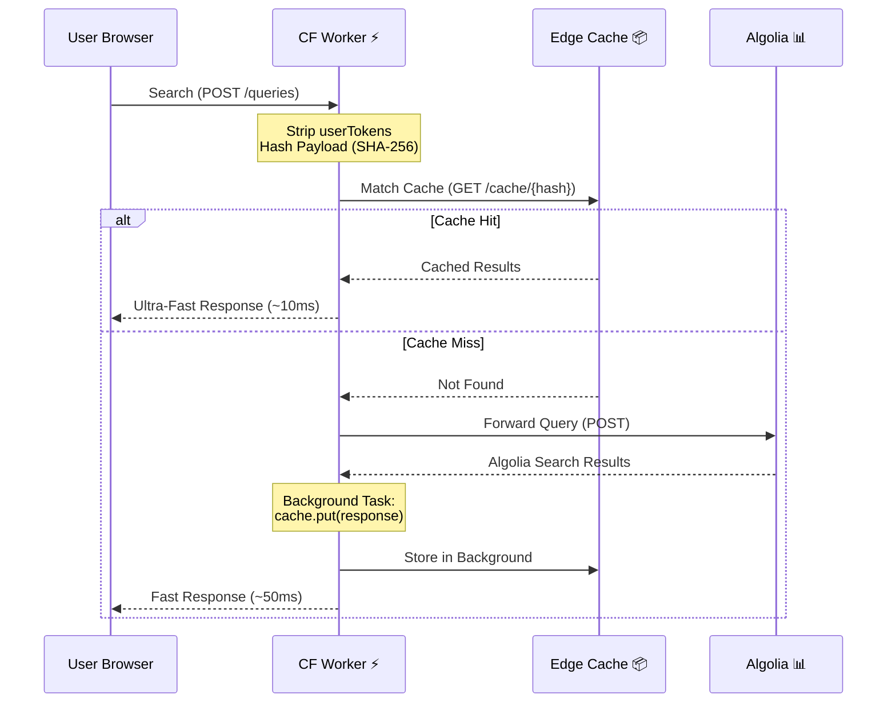

# ⚡️ Algolia Caching Proxy via Cloudflare Workers

[](https://www.algolia.com/)
[](https://workers.cloudflare.com/)
[](https://opensource.org/license/apache-2-0)

> A high-performance, drop-in **Cloudflare Worker middleware** that aggressively caches Algolia search requests globally at the edge, drastically slashing your Algolia operations bill without sacrificing search speed.
> 
> **⚠️ Disclaimer:** This project is an independent open-source tool and is not affiliated with, endorsed by, or supported by Algolia.

## 📖 What is this?

Algolia is blazingly fast but charges per search request. For high-traffic sites (e.g., e-commerce platforms, documentation hubs, or media portals), identical search queries are performed thousands of times a day. This directly translates to high, recurring costs. Even for open source or personal side projects, repetitive searches can quickly exhaust Algolia's free tier limits.

This **Cloudflare Worker** sits between your frontend application and Algolia's servers. It intercepts search requests and serves repeated queries directly from Cloudflare's massive global Edge CDN. The result? Cached requests **never** reach Algolia's servers, saving you money without sacrificing performance.

## ✨ Why You Need It

- 💸 **Huge Cost Savings**: Reduce billable Algolia operations by up to 100% for highly repetitive searches.
- ⚡️ **Edge Speed Delivery**: Serve cached search results from the absolute nearest Cloudflare node to your users (~10-30ms response times).
- 🔌 **Plug-and-Play Frontend Integration**: Integrates instantly by swapping out the Algolia host URL in your frontend client.
- 🔒 **Privacy-Safe & Deterministic**: Automatically strips dynamic, user-specific parameters (`userToken`) before hashing, ensuring that identical queries from different users safely share the exact same global cache.
- 🔑 **Universal Compatibility**: Supports all of Algolia's frontend libraries out of the box (InstantSearch, React, Vue, pure JS) by extracting credentials via both HTTP Headers and Query Parameters.
- 🏢 **Multi-App & Multi-Index Ready**: Because the SHA-256 cache key specifically incorporates the Algolia API Key found in the request payload, this worker natively and safely supports querying completely different Algolia Applications, API Keys, and Indexes simultaneously without any cache bleeding or collision. Deploy it once, and place it in front of all your projects.

### 💰 Cost Comparison

Algolia's pricing scales directly with your usage. Meanwhile, Cloudflare Workers offer a massive free tier and heavily discounted overages.

| Platform | Free Tier | Overage Cost | Pricing |
| :--- | :--- | :--- | :--- |
| **Algolia** | 10k searches/month | +$0.50 per 1K searches | [Algolia Pricing](https://www.algolia.com/pricing/) |
| **Cloudflare Workers** | 100k requests/day | +$0.30 per 1M requests | [Workers Pricing](https://developers.cloudflare.com/workers/platform/pricing/) |

### 📉 Estimated Monthly Savings

*Assuming cache is cleared once a month.*

| Searches / Month | Direct Algolia Cost | Cached via CF Worker | Cost Savings |
| ---: | ---: | ---: | ---: |
| **10,000** | $0 (Free) | $0 (Free) | **0%** |
| **100,000** | ~$45 | $0 (Free) | **100%** |
| **1,000,000** | ~$495 | $0 (Free) | **100%** |
| **10,000,000** | ~$4,995 | ~$5 | **~99.89%** |
| **100,000,000** | ~$49,995 | ~$27 | **~99.95%** |
| **1,000,000,000**| ~$499,995 | ~$297 | **~99.94%** |

> **Note**: Because the Worker needs at least one request to populate the cache initially (cache miss), your Algolia cost won't be absolute zero. However, it will be a fraction of the previous direct cost.

## 🏗️ How it Works

Algolia strictly requires `POST` requests for searches. However, virtually all CDN services (including Cloudflare) normally **only cache `GET` requests**. This worker uses a "Ghost GET Request" workaround to force Cloudflare to cache Algolia `POST` responses:

1. **Intercept & Cleanse**: Catches the incoming `POST` request and cleanses dynamic, non-cacheable tokens (like `userToken`) from the JSON POST body.
2. **Deterministic Hashing**: Generates a hyper-fast SHA-256 hash of the cleansed payload.
3. **Ghost GET Request**: Translates this hash into a simulated (ghost) `GET` URL to act as a unique cache-key for Cloudflare's Cache API.
4. **Resolution**:
   - **Cache Hit**: Resolves instantly directly from the Cloudflare Edge.
   - **Cache Miss**: Forwards the exact original `POST` payload to Algolia. Upon receiving the result, it is immediately served to the user, while simultaneously being saved to the Edge Cache via a background `ctx.waitUntil()` process.



## 🚀 Quick Start & Setup

### 1. Prerequisites

- [Node.js](https://nodejs.org/) installed on your machine.
- A free [Cloudflare Account](https://dash.cloudflare.com/sign-up).
- [Wrangler CLI](https://developers.cloudflare.com/workers/wrangler/install-and-update/) installed globally.

### 2. Installation

Clone the repository, enter the directory, and install the local packages:
```bash
git clone https://github.com/MarcinKilarski/algolia-caching-proxy-via-cloudflare-worker.git algolia-caching-proxy-via-cloudflare-worker
cd algolia-caching-proxy-via-cloudflare-worker
npm install
```

### 3. Development

Run the local Cloudflare development server:
```bash
npm run dev
```
Your worker will be locally accessible by default at `http://localhost:8787`.

### 4. Deploy to Production

To deploy your worker to Cloudflare, first you will need to authenticate your terminal with Cloudflare. You can do this by running:
```bash
npx wrangler login
```

Once authenticated, you can deploy the worker by running:
```bash
npm run deploy
```

## ⚙️ Configuration & Security

All major settings are located in `src/config.js`.

### Cache TTL (Time-To-Live)

Define how long search responses should stay cached:
- **`CDN_CACHE_TTL`**: Time on Cloudflare's Edge (Default: 1 Month).
- **`BROWSER_CACHE_TTL`**: Time in the user's local browser (Default: 1 Hour).

### Security & CORS Setup

> ⚠️ **Crucial for Production:** By default, `ALLOWED_ORIGIN` contains `'*'` for easy development and testing. This should be restricted before going live to prevent unauthorized access to your Algolia data or someone caching their own data in your account and using your bandwidth.

1. Open `src/config.js`.
2. Replace `'*'` with your actual frontend domain(s) (e.g., `'https://your-website.com'`). You can add multiple domains as separate strings in the array.
3. Redeploy the worker.
*(Note: For advanced CI/CD pipelines, consider overriding this value using `wrangler.jsonc` `[vars]` to avoid committing production domains to your source code repository).*

### 🛡️ Prevent Malicious Billing (Cache-Busting) Attacks

Because Algolia bills based on number of search requests, and this proxy caches does it based on the exact search string, an attacker could write a script that sends thousands of random, unique queries (e.g., `query="random-uuid-1"`). Since these will never hit the cache, and they will all be forwarded to Algolia and consume your Algolia quota.

You should configure **[Cloudflare Rate Limiting (WAF Rules)](https://developers.cloudflare.com/waf/rate-limiting-rules/)** on your Custom Domain to aggressively block IPs making an unnatural volume of search requests.

### Connect a Custom Domain (Highly Recommended)

Deploying to a default `.workers.dev` subdomain limits your caching capabilities. Attaching a Custom Domain in Cloudflare unlocks:

- **Smart Tiered Cache**: Instead of caching user requests only in the nearest Cloudflare datacenter, Cloudflare routes requests through centralized regional hubs. This significantly increases cache hit rates and reduces origin trips, **significantly lowering the number of requests sent to Algolia**. [Read more here.](https://developers.cloudflare.com/cache/how-to/tiered-cache/#smart-tiered-cache)
- **Manual Cache Purging**: Without a custom domain, you cannot manually clear the edge cache and must wait for the TTL to naturally expire.

#### How to configure

You can assign a custom domain using the Cloudflare Dashboard (under the Worker's **Triggers** tab), or by adding it directly to your `wrangler.jsonc` file:

```jsonc
"routes": [
  { 
    "pattern": "algolia-cache.yourdomain.com",
    "custom_domain": true
  }
]
```

## 💻 Client-Side Integration

To start routing traffic through your new Worker, add 'hosts' array to the Algolia client initialization config in your frontend code:

```javascript
import algoliasearch from 'algoliasearch';

const client = algoliasearch(
  'YOUR_APP_ID',
  'YOUR_SEARCH_API_KEY',
  {
    hosts: [
      // -----------------------------------------------------------
      // [OPTIONAL] LOCAL DEVELOPMENT
      // Uncomment the block below to route traffic to your local Wrangler dev server
      // when you run it locally.
      // (Make sure to comment out the Primary Production host and fallback hosts when doing this)
      // -----------------------------------------------------------
      // { protocol: "http", url: "localhost:8787" },

      // -----------------------------------------------------------
      // 1. PRIMARY HOST (PRODUCTION)
      // This routes all search requests through your deployed Cloudflare Worker.
      // (Make sure to replace "algolia-cache.your-website.com" with the domain you assigned to your worker!)
      // -----------------------------------------------------------
      { protocol: "https", url: "algolia-cache.your-website.com" },

      // -----------------------------------------------------------
      // 2. FALLBACK HOSTS (CRITICAL)
      // If the Cloudflare Worker fails or is unreachable, the Algolia client
      // will automatically retry the request using these official backup servers.
      // (Make sure to replace "YOUR_APP_ID" with your actual Application ID!)
      // -----------------------------------------------------------
      { protocol: "https", url: "YOUR_APP_ID-dsn.algolia.net" },
      { protocol: "https", url: "YOUR_APP_ID-1.algolianet.com" },
      { protocol: "https", url: "YOUR_APP_ID-2.algolianet.com" },
      { protocol: "https", url: "YOUR_APP_ID-3.algolianet.com" }
    ],
  }
);

// Initialize and use Algolia as normal
const index = client.initIndex('your_index_name');
index.search('query').then(({ hits }) => {
  console.log(hits);
});
```

> Read more in [Algolia's Custom Hosts Documentation](https://www.algolia.com/doc/libraries/sdk/customize#custom-hosts).

> **Peace of Mind Guarantee:** By explicitly defining these fallback hosts in your initialization, Algolia's SDK guarantees that if your Cloudflare Worker is ever down, misconfigured, or returning 5xx errors, it will instantly and smoothly route the user's search query to the official Algolia servers without breaking the frontend experience.

## ⚠️ Known Trade-offs & Limitations

Using an aggressive caching architecture inherently means you're trading a few of Algolia's dynamic features in exchange for speed and reduced costs. You must be aware of:

- **Search Only (Do not use for Backend/Indexing)**: This proxy is designed **exclusively for Search (Read) requests originating from frontend clients**. Do not configure your backend/indexing clients to use this proxy, as write operations will fail on Algolia's DSN endpoints.
- **Analytics Drift & AI Feature Corruption**: Since cached queries never physically hit Algolia, your internal Algolia dashboard analytics (top searches, click CTRs, conversions) will underreport volume. **Crucially, if you rely on AI features like Dynamic Re-Ranking, Query Categorization, or Click Analytics & Insights**, this proxy will break your tracking. It will serve the identical `queryID` to thousands of different users, resulting in highly distorted user journey tracking within Algolia's machine learning models.
- **No Native Personalization**: Algolia's "Personalized Results" feature heavily relies on the `userToken` header. Because this worker purposely strips the `userToken` off the request body (so the cache is homogenized globally across all users), native personalization will simply **not work**.
- **A/B Testing Impact**: If utilizing Algolia A/B testing dynamically behind the scenes, Cloudflare Edge caches might lock onto a specific A/B variant and erroneously serve it universally to all users.
- **P99 Initial Latency**: The very first time a brand new search term is queried (Cache Miss), the latency will feature a small 50-100ms penalty overhead due to the Worker acting as an intermediary network hop before consulting Algolia.

## 🔧 Maintenance & Troubleshooting

### Checking Cache Status

To verify if a response was served from the cache or fetched from the origin (Algolia), inspect the `cf-cache-status` header in the Worker's HTTP response.

- `HIT`: The response was served directly from Cloudflare's edge cache.
- `MISS`: The request was fetched from Algolia's origin and subsequently cached.
- `DYNAMIC`: The resource was not eligible to be cached based on your Cloudflare cache rules.

Read more in [Cloudflare's cf-cache-status header explained](https://www.debugbear.com/docs/cf-cache-status/).

### Live Worker Log Monitoring

If you're troubleshooting unexpected behavior, hook into real-time production Worker logs directly via your terminal:
```bash
npx wrangler tail algolia-caching-proxy-via-cloudflare-worker
```

### Invalidating Edge Caches

When performing a large-scale database sync directly to Algolia, you must force Cloudflare to wipe its edge cache (Note: this explicitly requires applying a Custom Domain mentioned above).

**Option 1: Via Cloudflare Dashboard UI:**
1. Select your domain.
2. Go to **Caching** > **Configuration**.
3. Hit **Purge Everything** (Or **Purge by Prefix**: `/cache/`).

See [Cloudflare Docs](https://developers.cloudflare.com/cache/how-to/purge-cache/) for more info.

**Option 2: Via Headless cURL (Automated Deployments):**
```bash
curl -X POST "https://api.cloudflare.com/client/v4/zones/<YOUR_ZONE_ID>/purge_cache" \
    -H "Authorization: Bearer <YOUR_API_TOKEN>" \
    -H "Content-Type: application/json" \
    --data '{"purge_everything":true}'
```

See [Cloudflare API Documentation](https://developers.cloudflare.com/api/resources/cache/) for more info.

## 📁 Project Structure

| File | Description |
| :--- | :--- |
| `src/index.js` | Primary Worker router handling Request/Response validation, cache verification, background storage, and origin forwarding. |
| `src/config.js` | Global system configurations governing cache TTLs and critical CORS origins. |
| `src/utils.js` | Cryptographic functions containing the deterministic SHA-256 worker hashing, CORS wrappers, and Algolia payload sanitization techniques. |
| `wrangler.jsonc` | Cloudflare Workers unified infrastructure declaration list. |

## 🤝 Contributing

Found a bug or have an improvement? Pull requests are highly welcome! Please submit an issue structurally detailing your changes before pushing large functional overhauls.

## 🙏 Acknowledgements

Inspired by:
- [Eric Turner's gist on Algolia Proxying](https://gist.github.com/etdev/bb49f0f60ea5ec9deb5977b1fbfb4046)
- [Cloudflare's Cache POST Request Example](https://developers.cloudflare.com/workers/examples/cache-post-request/)

## 📄 License

Released under the [Apache License 2.0](https://www.apache.org/licenses/LICENSE-2.0).

## ❓ Frequently Asked Questions (FAQ)

<details>
<summary><b>1. What exactly does this proxy do?</b></summary>
It intercepts Algolia search POST requests originating from your frontend. It checks if the exact same search has been made recently, and if so, returns the result instantly from Cloudflare's Edge Cache instead of hitting Algolia's servers and consuming your quota.
</details>

<details>
<summary><b>2. Is this officially supported by Algolia or Cloudflare?</b></summary>
No, this is an independent, open-source community project. It is not affiliated with, endorsed by, or supported by Algolia or Cloudflare.
</details>

<details>
<summary><b>3. How much money can I really save?</b></summary>
If your site has highly repetitive searches (like e-commerce, documentation hubs, or media portals), you can reduce your billable Algolia operations by up to 99%, depending on your cache TTL and traffic volume.
</details>

<details>
<summary><b>4. Will caching Algolia slow down my search?</b></summary>
No. In fact, cache hits are served directly from the nearest Cloudflare Edge node to the user, resulting in ultra-fast responses (~10-30ms) compared to a full trip to Algolia. Cache misses incur a tiny 50ms penalty.
</details>

<details>
<summary><b>5. What happens if the Cloudflare Worker goes down?</b></summary>
By configuring Algolia's official fallback hosts in your frontend client, Algolia's SDK guarantees that if the first host fails (your Worker), the query seamlessly routes to official Algolia servers without breaking the frontend experience.
</details>

<details>
<summary><b>6. Does this work with Algolia InstantSearch?</b></summary>
Yes! It is completely plug-and-play compatible with all Algolia frontend libraries (InstantSearch, React, Vue, pure JS) without any modifications to how InstantSearch works.
</details>

<details>
<summary><b>7. How do I clear or purge the cache when my database updates?</b></summary>
You can manually invalidate the Cloudflare Edge cache via the Cloudflare Dashboard UI or programmatically via a Headless cURL request using Cloudflare's API. This behavior requires a Custom Domain.
</details>

<details>
<summary><b>8. Why do I need a Custom Domain on Cloudflare to use this effectively?</b></summary>
A Custom Domain unlocks Cloudflare's Smart Tiered Cache (which drastically increases cache hit rates by routing requests through regional hubs) and allows you to manually purge the cache, which isn't natively possible on a default `.workers.dev` subdomain.
</details>

<details>
<summary><b>9. Does this support Algolia Personalization?</b></summary>
No. To ensure a high cache hit rate globally across all users, user-specific tokens (`userToken`) are stripped. Native Algolia personalization features will not work through this proxy.
</details>

<details>
<summary><b>10. Will this break my Algolia Analytics and Click Tracking?</b></summary>
Yes. Since cached requests never physically reach Algolia, your internal Algolia dashboard analytics will underreport search volume. AI features like Dynamic Re-Ranking and Query Categorization will also be severely affected.
</details>

<details>
<summary><b>11. How do you prevent attackers from running up my Algolia bill by bypassing the cache?</b></summary>
You should configure Cloudflare Rate Limiting (WAF Rules) on your Custom Domain to aggressively block IPs making an unnatural volume of random, unique search requests intentionally designed to bypass the cache.
</details>

<details>
<summary><b>12. Does this cache Algolia indexing or write operations?</b></summary>
No. This proxy is designed exclusively for Search (Read) requests. You should not route your backend indexing or write operations through this proxy, they will fail.
</details>

<details>
<summary><b>13. How does the proxy handle different Algolia indices or API keys?</b></summary>
The unique cache key natively incorporates the API Key and query payload in its mathematical hash, while preserving the Algolia Application ID and Index Name within the URL path structure. This means it safely supports querying completely different Algolia Applications and Indexes simultaneously without cache bleeding.
</details>

<details>
<summary><b>14. Can I use this with frontend frameworks like React, Vue, or Angular?</b></summary>
Yes, absolutely. You only need to change the `hosts` array during the frontend initialization of the Algolia client. It continues to work normally within your framework of choice's InstantSearch wrapper.
</details>

<details>
<summary><b>15. What cache hit rate can I expect?</b></summary>
This heavily depends on your specific traffic patterns. High-traffic sites with common queries or high-volume default empty queries will see very high cache hit rates, while sites with entirely unique, long-tail queries will see lower hit rates.
</details>

<details>
<summary><b>16. How long are search results cached for?</b></summary>
By default, results are cached at the Cloudflare Edge for 1 month (`CDN_CACHE_TTL`) and in the user's browser for 1 hour (`BROWSER_CACHE_TTL`). Both values can be easily adjusted in `src/config.js`.
</details>

<details>
<summary><b>17. Does the proxy cache responses in the user's browser, or just on the Edge server?</b></summary>
Both. It returns specific `Cache-Control` headers that instruct the user's local browser to cache the response for `BROWSER_CACHE_TTL`, and Cloudflare's CDN to cache it for `CDN_CACHE_TTL`.
</details>

<details>
<summary><b>18. Where do I configure the Allowed Origins for CORS security?</b></summary>
In `src/config.js`, you should change the `ALLOWED_ORIGIN` rule from `['*']` to strictly contain your actual frontend production domains to prevent unauthorized API requests against your project payload.
</details>

<details>
<summary><b>19. Can Algolia shut down my account for doing this?</b></summary>
While Algolia's Terms of Service generally do not explicitly ban CDN caching middle-layers (which are standard architectural patterns), it does reduce their revenue. As this is an open-source tool running on your own infrastructure, you are responsible for mitigating risks and reviewing the ToS of any service provider.
</details>

<details>
<summary><b>20. Does this work with A/B testing in Algolia?</b></summary>
No. If you use Algolia A/B testing dynamically behind the scenes, Cloudflare Edge caches might lock onto a specific A/B variant on the first cache miss and erroneously serve it universally to all users.
</details>

<details>
<summary><b>21. Does this work with Algolia Recommend?</b></summary>
Yes, as long as the requests are made via HTTP POST. However, since Algolia Recommend relies heavily on user behavior and personalization, aggressive edge caching might degrade the effectiveness of the recommendations.
</details>

<details>
<summary><b>22. How do I debug if caching is actually working?</b></summary>
Inspect the network tab in your browser's developer tools. Look at the response headers for your search request. The `cf-cache-status` header will indicate `HIT` (served from cache) or `MISS` (served from Algolia).
</details>

<details>
<summary><b>23. Can I cache based on user roles or permissions (Secured API Keys)?</b></summary>
This proxy is designed for public data. If you use Algolia Secured API Keys with embedded filters for row-level security, they will be cached based on the token. However, you must carefully modify the proxy to not strip role-identifying tokens, otherwise users might see unauthorized cached data.
</details>

<details>
<summary><b>24. Does this proxy help with rate limiting users?</b></summary>
The Worker itself doesn't inherently rate-limit, but by routing traffic through Cloudflare, you can easily apply Cloudflare's Web Application Firewall (WAF) and Rate Limiting rules before the request even reaches your Algolia quota.
</details>

<details>
<summary><b>25. Can I use this with Algolia's free "Build" tier?</b></summary>
Absolutely! In fact, it is highly recommended. It helps prevent accidental traffic spikes or scrapers from silently exhausting your 10,000 monthly search limit.
</details>

<details>
<summary><b>26. Will this break Algolia Rules (Visual Editor)?</b></summary>
No. Standard Algolia Rules (e.g., pinning an item, synonyms) execute on Algolia's servers. The cached response will correctly contain the rule-applied results. Changing a rule simply requires purging the cache.
</details>

<details>
<summary><b>27. Can I cache multiple Algolia indices with one Cloudflare Worker?</b></summary>
Yes. The requested index name is part of the URL path, meaning it naturally becomes part of the unique URL cache key, while the payload is independently hashed. Two identical searches on different indices will generate two distinct cache entries.
</details>

<details>
<summary><b>28. Does this cache Algolia Autocomplete queries?</b></summary>
Yes. Autocomplete queries are fundamentally just standard Algolia search requests. Since they trigger on every keystroke, caching them saves enormous amounts of quota.
</details>

<details>
<summary><b>29. Does this work for native mobile apps (iOS/Android)?</b></summary>
Yes. Update your iOS or Android Algolia SDK initialization slightly to point its custom host array to your Cloudflare Worker's URL. The network layer handles the rest.
</details>

<details>
<summary><b>30. What happens to "No Results" searches?</b></summary>
Empty results (0 hits) are still valid 200 OK HTTP responses from Algolia. The proxy caches these too, which prevents users (or scrapers) spamming invalid queries from draining your quota.
</details>

<details>
<summary><b>31. Can I bypass the proxy for specific, critical queries?</b></summary>
You would handle this in your frontend routing logic. Standard queries use an Algolia client pointing to Cloudflare; real-time critical queries use a separate Algolia client pointing directly to Algolia.
</details>

<details>
<summary><b>32. Will I hit Cloudflare Worker CPU limits?</b></summary>
Highly unlikely. Stripping JSON and generating a SHA-256 hash takes fractions of a millisecond, well below Cloudflare's 10ms (free) or 50ms (paid) CPU limits.
</details>

<details>
<summary><b>33. Can I use Cloudflare KV or Durable Objects instead of Cache API?</b></summary>
You could modify the code to do so, but the native Cache API is significantly faster, strictly designed for HTTP payload storage, and doesn't incur the granular read/write costs of KV.
</details>

<details>
<summary><b>34. What if my Algolia POST payload is unusually large?</b></summary>
Cloudflare's Cache API natively supports caching massive response payloads (up to 512MB). For incoming search queries, the POST payload sent by the user must simply stay under Cloudflare Workers' generous 100MB incoming request limit, which is safely well above anything Algolia would typically accept.
</details>

<details>
<summary><b>35. Does it cache the initial empty query (default load)?</b></summary>
Yes. When InstantSearch loads, it often fires an empty query `""` to populate the initial UI. Because every user triggers this exact same query, caching it yields the highest savings.
</details>

<details>
<summary><b>36. How does the proxy handle Algolia API errors (e.g., 400 or 500)?</b></summary>
The proxy only caches `200 OK` responses. Any error codes returned by Algolia are passed directly back to the client and bypass the edge cache.
</details>

<details>
<summary><b>37. Does this proxy modify the actual Algolia JSON response?</b></summary>
No. The worker returns the exact, byte-for-byte JSON response provided by Algolia. Your frontend libraries will not notice any difference.
</details>

<details>
<summary><b>38. Can I use this with Algolia Faceting and Filtering?</b></summary>
Yes. All facet selections, filters, and numeric ranges are included in the POST body. The proxy hashes the entire body, meaning `color:red` and `color:blue` queries are correctly cached as separate requests.
</details>

<details>
<summary><b>39. Can I implement custom authentication inside this Worker?</b></summary>
Yes, you can edit the worker to validate JWTs or verify custom headers before processing the request, providing an extra layer of security before Cloudflare even checks the cache.
</details>

<details>
<summary><b>40. Is the SHA-256 hash secure enough to prevent cache collisions?</b></summary>
Yes. A SHA-256 collision is virtually impossible. Even with trillions of unique search possibilities, you will not experience cache collisions crossing over to different queries.
</details>

<details>
<summary><b>41. How do I use this across multiple environments (Staging vs. Prod)?</b></summary>
Deploy two separate Cloudflare Workers (e.g., `algolia-proxy-staging` and `algolia-proxy-prod`), or use Cloudflare's environment variables to manage different ALLOWED_ORIGIN configurations.
</details>

<details>
<summary><b>42. Does Algolia have its own "built-in" caching?</b></summary>
Algolia does utilize internal engine-level caching for speed. However, you are still billed for the network request reaching their servers. Our Cloudflare Worker prevents the request from reaching them entirely.
</details>

<details>
<summary><b>43. Can I log cache hits and misses for analytics?</b></summary>
Yes, you can enable Cloudflare Logpush or Worker Analytics on your dashboard to monitor traffic, or add a `console.log` inside the worker and tail it using `wrangler tail`.
</details>

<details>
<summary><b>44. Does this violate Algolia's Terms of Service?</b></summary>
Algolia's Terms of Service generally do not prohibit standard CDN caching layers (a standard architectural pattern). However, since it deliberately reduces their billable revenue, you should review your specific enterprise contract if applicable.
</details>

<details>
<summary><b>45. Can I deploy this using Infrastructure as Code (Terraform, Pulumi)?</b></summary>
Yes. Because it is a standard Cloudflare Worker, you can manage and deploy the script using the Cloudflare Terraform provider or Pulumi just like any other worker.
</details>

<details>
<summary><b>46. Will this proxy work with Algolia multi-cluster / DSN setups?</b></summary>
Yes. The worker simply acts as a standard HTTP client forwarding the payload to the provided Algolia endpoint. DSN routing rules still apply on cache misses.
</details>

<details>
<summary><b>47. What happens if Cloudflare Cache is purged globally while under high traffic?</b></summary>
The next wave of requests will be "Cache Misses" and will hit Algolia directly. Once Algolia responds, Cloudflare will instantly re-populate the edge nodes, shielding Algolia again.
</details>

<details>
<summary><b>48. Can I use Cloudflare Page Rules to control the Worker's cache?</b></summary>
No. Because the Worker programmatically manages the Cache API using the "Ghost GET Request" workaround, standard Cloudflare Page Rules (which operate at the routing level) will not affect it.
</details>

<details>
<summary><b>49. Why not just cache directly in the user's browser using local storage?</b></summary>
Browser caching only benefits a single user *after* they search for something twice. Edge caching benefits *all* users globally the moment *any* single user searches for it once.
</details>

<details>
<summary><b>50. Can I modify what gets stripped from the payload?</b></summary>
Yes! If you have custom parameters that don't affect search results but vary per user (like analytics tags), open `src/utils.js` and add those keys to the `normalizeAlgoliaBody` function to improve your hit rate.
</details>

<details>
<summary><b>51. Does this proxy support the `stale-while-revalidate` caching strategy?</b></summary>
Yes, you can easily implement `stale-while-revalidate` by returning the appropriate `Cache-Control` header from the Worker. This serves a slightly stale cached response to the user immediately while re-fetching fresh data from Algolia in the background.
</details>

<details>
<summary><b>52. Can I use Cloudflare Workers Unbound for this proxy?</b></summary>
Yes, you can switch the worker to the 'Unbound' usage model if you anticipate processing payloads or background tasks that need more than the standard 50ms CPU time threshold given in the 'Bundled' pricing model, though this is rarely necessary for this specific use case.
</details>

<details>
<summary><b>53. How do I clear the cache for a specific set of queries instead of the entire cache?</b></summary>
Cloudflare allows "Purge by Cache-Tag" or "Purge by URL" on Enterprise plans. If on a lower tier, you can strictly purge by the specific "Ghost GET Request" URL if you know the exact SHA-256 hash of the payload you wish to clear, but generally, bulk purging `purge_everything` is standard for database syncs.
</details>

<details>
<summary><b>54. Does this proxy interfere with Algolia's IP-based rate limiting?</b></summary>
Because all traffic paths through Cloudflare's Edge, Algolia might see a high volume of requests coming from Cloudflare IPs. Algolia usually trusts Cloudflare IPs natively, but to be completely safe, the Worker should forward the true client IP using the `X-Forwarded-For` and `CF-Connecting-IP` headers so Algolia applies limits correctly.
</details>

<details>
<summary><b>55. Why is the "Ghost GET Request" necessary instead of just caching the POST directly?</b></summary>
Cloudflare's native Cache API (`cache.put()`) explicitly rejects any `Request` object with a `POST` method. To utilize the blazing fast, free CDN Edge Cache, the Worker must trick the Cache API by converting the `POST` payload into a deterministic `GET` request URL.
</details>

<details>
<summary><b>56. Can I proxy secondary Algolia requests like `getObjects` or `getSettings`?</b></summary>
While the proxy is primarily built around the `/queries` search endpoint, it can theoretically be expanded to handle `GET /1/indexes/*/` objects. However, since `GET` requests are natively cacheable, you wouldn't need the complex payload-hashing logic.
</details>

<details>
<summary><b>57. Does the proxy cache Algolia's multiple queries endpoint (`/1/indexes/*/queries`)?</b></summary>
Yes! The proxy intercepts the single POST request that contains the array of multiple queries. The hash is generated based on the entire array. Consequently, the combination of those multiple queries is cached as one unified response.
</details>

<details>
<summary><b>58. Can I integrate this with Next.js App Router (React Server Components)?</b></summary>
Yes. You can route server-side fetches through the proxy. Since React Server Components hit the Cloudflare Worker instead of Algolia, the server-to-server latency is significantly reduced during Next.js SSR or SSG builds.
</details>

<details>
<summary><b>59. Can I integrate this proxy with SvelteKit or Nuxt.js SSR?</b></summary>
Yes, similarly to Next.js, framework meta-routing tools that execute server-side searches during SSR can dramatically benefit from hitting the Cloudflare Edge Worker rather than routing all the way to Algolia's central servers.
</details>

<details>
<summary><b>60. How does the proxy handle large search responses (e.g., 10MB+ JSON payloads)?</b></summary>
Cloudflare handles large streaming responses gracefully. The caching size limitation of a single cached file on Cloudflare is 512MB by default, meaning even the most excessively massive JSON Algolia responses fits safely without truncation.
</details>

<details>
<summary><b>61. Can I use Cloudflare Access to protect my testing/staging Algolia proxy?</b></summary>
Yes, you can layer Cloudflare Zero Trust (Access) in front of the staging version of this Worker. This restricts access to the staging indices purely to developers authenticated via your identity provider (Google, Okta, etc.), shielding sensitive data.
</details>

<details>
<summary><b>62. What happens if Cloudflare's Edge Cache API temporarily goes down?</b></summary>
If `caches.default.match()` fails due to a rare internal Cloudflare error, the Worker will generally fallback via the `catch` block and gracefully function as a pure pass-through proxy, guaranteeing the user gets their search results directly from Algolia.
</details>

<details>
<summary><b>63. Does the proxy add any CORS headers to the response on a cache hit?</b></summary>
Yes. The worker ensures that all strictly required CORS headers (`Access-Control-Allow-Origin`, `Access-Control-Allow-Headers`) are appended to the frozen Cache response before serving it, so the browser doesn't block the cached payload.
</details>

<details>
<summary><b>64. Can I modify the Algolia response inside the Worker before sending it to the client?</b></summary>
Absolutely. Simply extract the JSON from the Algolia response, modify the `hits` array or metadata (e.g., adding promotional banners or filtering restricted items), serialize it back to JSON, `cache.put()` it, and return it to the user.
</details>

<details>
<summary><b>65. How can I stream logs from this proxy to Datadog or Sentry?</b></summary>
You can utilize Cloudflare Logpush to stream all Worker execution logs natively to Datadog. Alternatively, you can catch errors and perform a non-blocking `ctx.waitUntil(fetch("sentry-url"))` call inside the Worker logic.
</details>

<details>
<summary><b>66. Does this proxy handle gzip or Brotli compression?</b></summary>
Yes. Cloudflare's network natively negotiates compression with the user's browser (Brotli/zstd/gzip). The response delivered from the Edge cache is compressed automatically, saving bandwidth and accelerating TTFB.
</details>

<details>
<summary><b>67. Can I cache responses based on the visitor's geographic location (geo-routing)?</b></summary>
Yes, you can utilize `request.cf.country` or `request.cf.city` inside the Worker to append a geo-identifier to the SHA-256 hash. This forces users in the US to receive a different cached Algolia payload than users in the EU.
</details>

<details>
<summary><b>68. Is this proxy compliant with GDPR and CCPA?</b></summary>
Yes. Because the explicit intent of this proxy is to strip PII (like `userToken`) before hashing and returning public, homogenized data, it does not permanently store any personalized data on Cloudflare's servers.
</details>

<details>
<summary><b>69. How does this proxy affect TTFB (Time to First Byte) metrics?</b></summary>
For cache hits, TTFB is massively improved (often dropping from 150ms to 15ms) because the TCP handshake and payload generation conclude locally at the Cloudflare Edge rather than traversing across continents to the Algolia server.
</details>

<details>
<summary><b>70. If two users search the exact same term but one sorts by date and other by price, do they share a cache?</b></summary>
No. Algolia natively incorporates sort strategies into the payload parameters (e.g., via different index targets or specific filters). The POST body differs, resulting in two distinct SHA-256 hashes, keeping the caches accurately segmented.
</details>

<details>
<summary><b>71. Can this proxy protect against DDoS attacks aimed at my Algolia index?</b></summary>
Immensely. Since malicious high-volume requests identical in nature are caught directly at the edge, an L7 DDoS attack hitting the same query continually will be instantly soaked up by Cloudflare's Cache free of charge. Your Algolia quota remains completely untouched.
</details>

<details>
<summary><b>72. Are preflight `OPTIONS` requests also cached?</b></summary>
No. Cloudflare natively handles `OPTIONS` requests extremely quickly. The proxy responds to them correctly based on the `ALLOWED_ORIGIN` rules defined in `config.js`, avoiding the need to forcefully cache them.
</details>

<details>
<summary><b>73. Does this proxy work if my Algolia application is hosted in a specific region (e.g., EU-only)?</b></summary>
Yes. The proxy forwards the Cache Miss payload directly to your Algolia App ID and its respective global/regional DSN cluster. You don't need to change any logic inside the proxy; Algolia routes the request natively.
</details>

<details>
<summary><b>74. Can I use this proxy to rewrite the search query before it reaches Algolia (e.g., autocorrect)?</b></summary>
Yes. You can intercept the JSON body, intercept the `query` string, run it through a lightweight spell-checker, alter it, and pass the new payload to Algolia. The result of the altered query will then be securely cached.
</details>

<details>
<summary><b>75. How does this proxy handle Algolia query parameters like `clickAnalytics=true`?</b></summary>
By default, they remain in the payload and are sent to Algolia. However, due to user-homogenization, the analytics will be vastly warped. It's recommended to either refrain from utilizing `clickAnalytics` or manually strip the parameter inside `utils.js` before hashing.
</details>

<details>
<summary><b>76. Does using `cache.put()` in the background block the user's response?</b></summary>
No. Using Cloudflare's `ctx.waitUntil()` ensures that the user receives their HTTP response immediately, while the caching mechanism finishes processing in the background asynchronously without impacting latency.
</details>

<details>
<summary><b>77. What happens if a user aborts their search request before the proxy replies?</b></summary>
If a browser cancels an inflight HTTP connection on a Cache Hit, nothing changes. On a Cache Miss, the proxy may still finish the background request to Algolia and subsequently populate the edge cache anyway, meaning the next query is pre-warmed.
</details>

<details>
<summary><b>78. Can I deploy a single Cloudflare Worker to proxy multiple different Algolia applications?</b></summary>
Yes. Because the explicit Application ID is natively extracted and mapped into the routed request url path while the API Key is mathematically hashed, different applications interacting with the single worker naturally segment their caches, removing any risk of cross-application data bleeding.
</details>

<details>
<summary><b>79. Does the Cloudflare Worker cache respect the HTTP `Cache-Control: no-cache` header sent by a browser?</b></summary>
The Worker has native jurisdiction over ignoring or bypassing cache rules. By default, it ignores client-side request cache-busting directives to strictly preserve the security of your Algolia bill against forced-fetch scripts.
</details>

<details>
<summary><b>80. Can I completely block empty queries `query=""` from reaching Algolia in the Worker?</b></summary>
Yes! If you do not want your UI to populate with raw un-searched inventory upon load, you can instruct the Worker to return a dummy `{"hits": []}` response manually when `query=""`, completely zeroing out that quota usage.
</details>

<details>
<summary><b>81. Can I use this proxy with Algolia Crawler?</b></summary>
No. Algolia Crawler is a backend indexing pipeline meant to scrape URLs and push content to Algolia databases. The proxy acts as a read-only endpoint optimized for frontend query consumption, not backend ingestion.
</details>

<details>
<summary><b>82. Does this proxy handle HTTP/3 (QUIC) connections?</b></summary>
Yes. Cloudflare enables HTTP/3 natively. The connection between your user's browser and the Edge Worker operates over QUIC, delivering the cached payload remarkably fast, especially on mobile networks.
</details>

<details>
<summary><b>83. Is it possible to cache Algolia Search responses directly in Cloudflare D1 (SQL)?</b></summary>
While mechanically possible, accessing an SQL row in D1 for every caching operation carries significant latency and read/write execution costs compared to the native memory-speed of the distributed Edge Cache API.
</details>

<details>
<summary><b>84. Can I monitor cache metrics using Cloudflare's GraphQL Analytics API?</b></summary>
Yes. Because the Worker maps cached requests to pseudo `GET` URLs on your custom domain, you can query Cloudflare's GraphQL API to precisely graph the volume of Cache Hits versus Misses for your Worker path.
</details>

<details>
<summary><b>85. What is the max URL length supported for the "Ghost GET Request"?</b></summary>
The proxy translates the SHA-256 hash (64 characters) into a path `https://your-worker-domain.com/cache/1/indexes/YOUR_INDEX_NAME/queries/<hash>`. Therefore, the URL length is completely predictable and well under any CDN or protocol limit (e.g., 2048 characters).
</details>

<details>
<summary><b>86. Can I use this proxy to merge results from Algolia and another database?</b></summary>
Yes! In the case of a Cache Miss, you can execute a `fetch` sequentially or simultaneously to both Algolia and your private database (or another service), map and merge the JSON objects, and `cache.put()` the resulting hybrid payload.
</details>

<details>
<summary><b>87. How do I test the edge caching behavior locally on my machine?</b></summary>
The local Wrangler development server (`npm run dev`) utilizes an emulated version of Cloudflare's Cache API via `Miniflare`. It allows you to simulate Cache Hits, Misses, and TTL expirations precisely as they will operate in production.
</details>

<details>
<summary><b>88. Does the proxy forward the `User-Agent` string to Algolia?</b></summary>
Yes. Generally, the proxy passes along non-sensitive headers (like `User-Agent`, `Referer`) into the `fetch` request heading to Algolia, though this rarely affects search results.
</details>

<details>
<summary><b>89. If Algolia throttles the Worker's IP, will all my users be blocked?</b></summary>
Algolia maintains very high threshold allocations specifically because massive corporate gateways (like Cloudflare) funnel massive amounts of traffic through singular egress IPs. Plus, most queries never reach Algolia due to the high cache hit rate.
</details>

<details>
<summary><b>90. Can I conditionally bypass the cache if a specific header or query param is present?</b></summary>
Yes. You can implement conditional branching in `index.js` where `if (request.headers.get("X-Bypass-Cache") === "true")` forces the system to skip the `caches.default.match` checking and directly forward the request to the Algolia origin.
</details>

<details>
<summary><b>91. Will this proxy increase my Cloudflare bandwidth costs?</b></summary>
Cloudflare does not bill for egress bandwidth. The Worker executes within the free tier usage or minimal compute usage bill. Therefore, serving massive JSON payloads from the Edge will absolutely not affect your Cloudflare CDN bill.
</details>

<details>
<summary><b>92. Can I use Cloudflare Workers Analytics Engine with this proxy?</b></summary>
Yes. You can wire the Analytics Engine directly into the Worker to log granular, custom metrics—such as which specific search terms triggered Cache Misses—without passing any load to your Algolia dashboard.
</details>

<details>
<summary><b>93. Does the proxy work with Algolia NeuralSearch?</b></summary>
Yes. NeuralSearch acts strictly during index generation and semantic evaluation on Algolia's servers. From the frontend perspective, the client simply submits a query, which the proxy intercepts and safely caches just like any standard query.
</details>

<details>
<summary><b>94. Are API keys exposed or stored in the Edge Cache?</b></summary>
This proxy functions implicitly for "Search-Only" API Keys designed for public exposure. Using an Admin Key is explicitly forbidden from frontend requests, as it carries total system access risks outside of simple caching concerns.
</details>

<details>
<summary><b>95. How does the proxy handle concurrent identical searches before the cache is populated?</b></summary>
By default, if 100 users query exactly the same payload before the cache validates, 100 identical requests will reach Algolia (Cache Stampede). However, deploying complex in-flight concurrency locks within Workers is possible but rarely needed at this scale.
</details>

<details>
<summary><b>96. What happens if Algolia updates a document but the cache hasn't expired?</b></summary>
Users will receive the old cached document until the `CDN_CACHE_TTL` organically lapses. To forcefully synchronize the frontend with an instant backend database update, you must configure a cache-purge webhook from your CI/CD or backend pipeline.
</details>

<details>
<summary><b>97. Can I write an automated cron job to pre-warm the cache for common queries?</b></summary>
Yes. You can utilize a separate Cloudflare Cron Trigger or GitHub Actions script to fire identical `POST` payloads on a scheduled basis, automatically populating the edge cache during low-traffic periods so visitors never experience a slow response.
</details>

<details>
<summary><b>98. How does the proxy handle pagination requests (e.g., `page=2`, `page=3`)?</b></summary>
Page variables are contained inside the payload. E.g., substituting `{"page": 0}` with `{"page": 1}` alters the SHA-256 hash completely. Thus, every specific page of a search sequence is uniquely cached alongside its core query payload.
</details>

<details>
<summary><b>99. Can I serve a fallback/mock JSON response if Algolia is completely down?</b></summary>
Yes. In the event Algolia serves a 5xx timeout error on a Cache Miss, you can configure the Worker to instantly return a customized "System currently unavailable" mock JSON response format avoiding a crashing front-end UI.
</details>

<details>
<summary><b>100. Does this architecture introduce a single point of failure (SPOF)?</b></summary>
While replacing Algolia's native network SDK routing with a single domain presents slightly higher SPOF risks, guaranteeing the utilization of the backup Fallback Hosts embedded in the frontend configuration eliminates virtually all of this downtime risk.
</details>